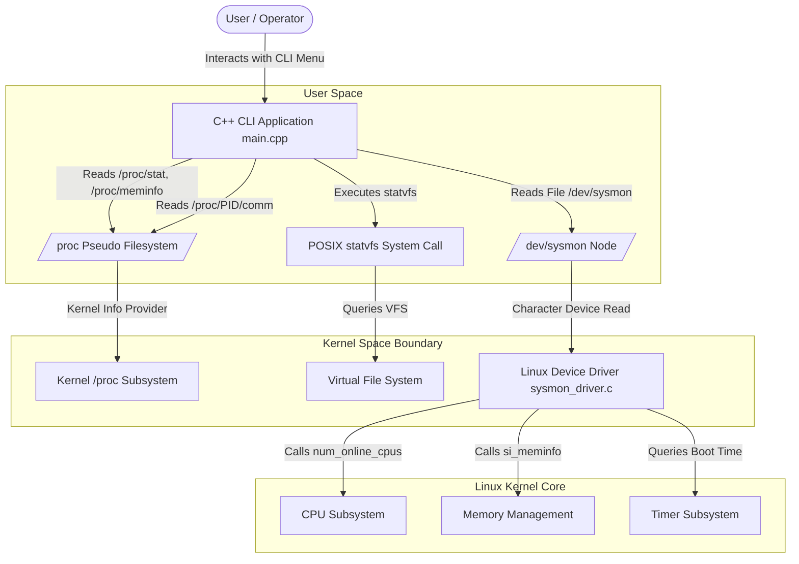

# Architecture Diagram

This document describes the hardware and software subsystem interaction layers for the Linux System Monitor and Process Viewer project.

---

## System Architectural Diagram



---

## ASCII Architecture Overview

```
                   +-------------------+
                   |   User / Operator |
                   +---------+---------+
                             |
                             v
               +---------------------------+
               |    C++ CLI Application    |
               |        (main.cpp)         |
               +-------------+-------------+
                             |
       +---------------------+---------------------+
       |                     |                     |
       v                     v                     v
+--------------+     +---------------+     +---------------+
| /proc Filesystem   |  statvfs("/")  |     |  /dev/sysmon  |
| (CPU, Memory,      | (Disk Space   |     | (Misc Device  |
|  Processes)        |  Information) |     |  Node)        |
+--------------+     +---------------+     +-------+-------+
                                                   |
===================================================|====================
                                KERNEL BOUNDARY    |
===================================================|====================
                                                   v
                                           +---------------+
                                           | sysmon_driver |
                                           | (Kernel Mod)  |
                                           +-------+-------+
                                                   |
                                                   v
                                           +---------------+
                                           | Linux Kernel  |
                                           |  Subsystems   |
                                           +---------------+
```
