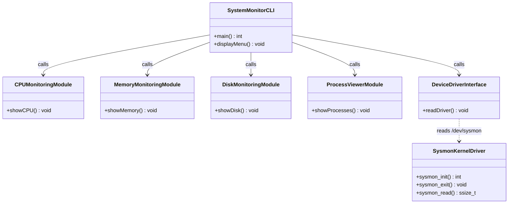

# Logical Component / Class Diagram

> **Design Note:** The actual C++ implementation is **function-based** and procedural rather than object-oriented class-based. The diagram below represents the **logical component structure** and maps system modules directly to the concrete functions implemented in `src/main.cpp` and `driver/sysmon_driver.c`.

---

## Component Diagram (Mermaid)

---

## Function Mapping Table

| Logical Component | C++ / C Source File | Core Function / Entry Point | System Interface Used |
|---|---|---|---|
| Main Menu Controller | `src/main.cpp` | `main()` | `std::cin` / `std::cout` |
| CPU Usage Engine | `src/main.cpp` | `showCPU()` | `/proc/stat` |
| Memory Usage Engine | `src/main.cpp` | `showMemory()` | `/proc/meminfo` |
| Disk Usage Engine | `src/main.cpp` | `showDisk()` | `statvfs("/")` |
| Process Enumerator | `src/main.cpp` | `showProcesses()` | `/proc/[PID]/comm` |
| Driver Reader Interface | `src/main.cpp` | `readDriver()` | `/dev/sysmon` |
| Kernel Misc Driver | `driver/sysmon_driver.c` | `sysmon_read()` | `copy_to_user()`, `si_meminfo()` |