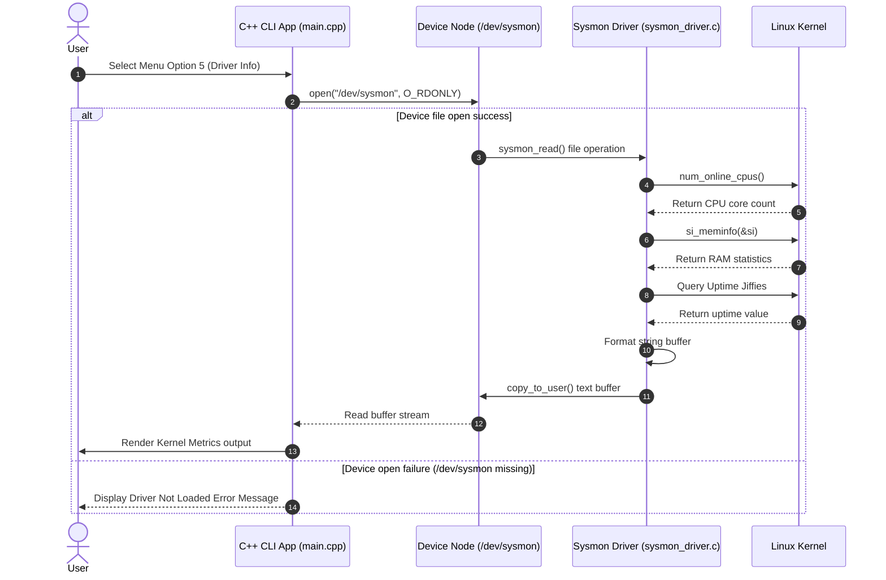

# Sequence Diagram

This diagram details the control and data sequence when a user queries kernel telemetry via option 5 in the C++ application.

---

## Integration Sequence (Mermaid)

---

## Procedural Text Flow
1. User selects `5` on CLI menu.
2. `main.cpp` invokes `readDriver()`.
3. `readDriver()` opens stream `/dev/sysmon`.
4. Kernel routes file read call to `sysmon_read()` inside `sysmon_driver.c`.
5. `sysmon_read()` queries active CPU cores, memory status (`si_meminfo`), and uptime.
6. Driver copies formatted string to user space memory via `copy_to_user()`.
7. `readDriver()` prints text to stdout.